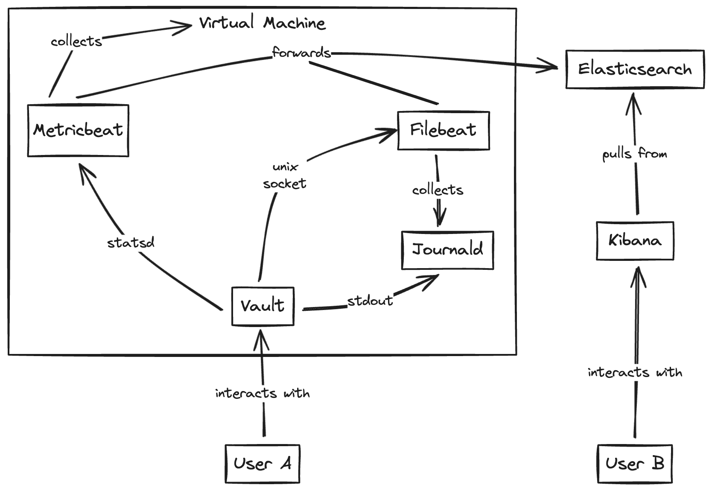

# Vault Audit Logs

***NOTE: This repository is for demo purposes only***

### Overview
Vault audit logs contain the full request/response objects for every interaction with Vault. Audit logs are critically important as they explain **who did what, and when**.

Vault audit logs are not enabled by default. Audit devices must be enabled by a root user using the `vault audit enable` command. 

It is **highly recommended** that you configure Vault to use multiple audit devices. Audit failures can prevent Vault from servicing requests, so it is important to enable at least two audit devices to prevent [blocking failures](https://developer.hashicorp.com/vault/docs/audit#blocked-audit-devices).

### Demo Diagram


### Usage
```bash
# create services
$ docker compose up -d

# configure vault
$ ./scripts/setup.sh

# generate sample events
$ ./scripts/events.sh

# vault:         http://localhost:8200
# kibana:        http://localhost:5601
# elasticsearch: http://localhost:9200

# cleanup
$ docker compose down
```

### Kibana
Follow [these steps](https://www.elastic.co/guide/en/kibana/8.12/data-views.html#settings-create-pattern) to create a Data view within Kibana.

1. Open **Discover**, and then open the data view menu.
2. Click **Create a Data view**.
3. Give your Data view a name.
4. Start typing in the Index pattern field, and Kibana looks for the names of indices, data streams, and aliases that match your input.
5. Open the **Timestamp** field dropdown, and then select the default field for filtering your data by time.
6. Click **Save Data view to Kibana**.


### Full Observability
Observability is the ability to measure the internal states of a system by examining its outputs. In the context of HashiCorp Vault, the key outputs to examine are log files, telemetry metrics, and data scraped from API endpoints.

There are many different monitoring stacks on the market today. The diagram below leverages the **Elastic Stack**, but any modern monitoring stack can be substituted.

The following items are being captured:
- Vault Operational Logs
- Vault Audit Logs
- Vault Telemetry
- Host Metrics

<br>


